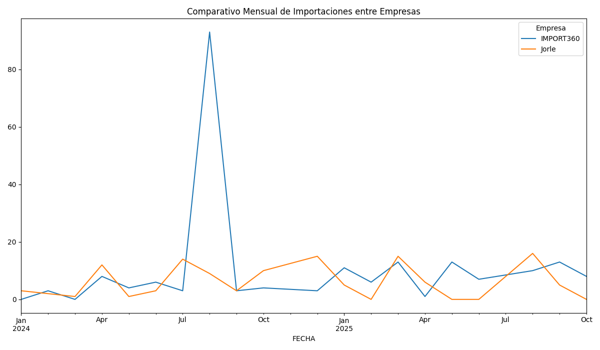
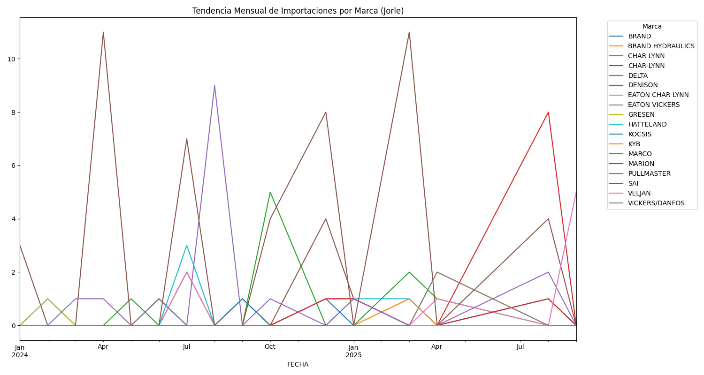
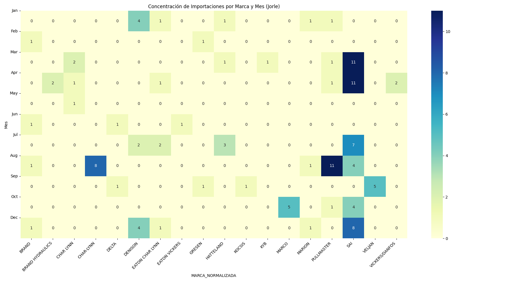
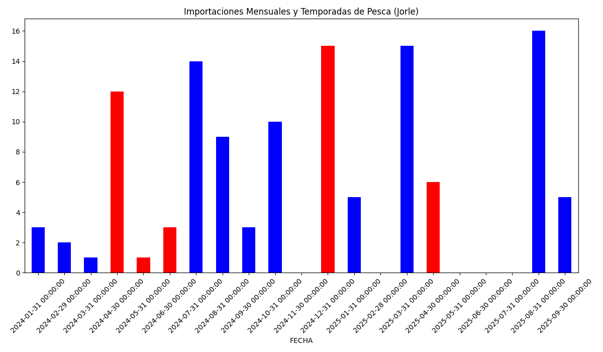
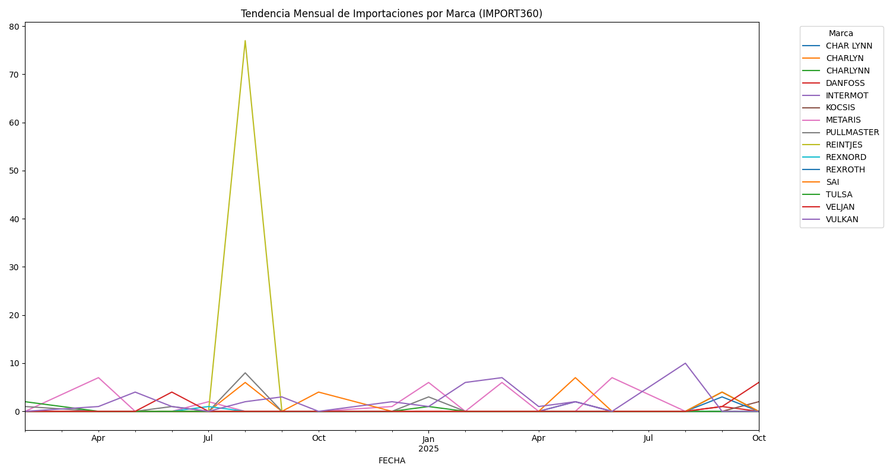
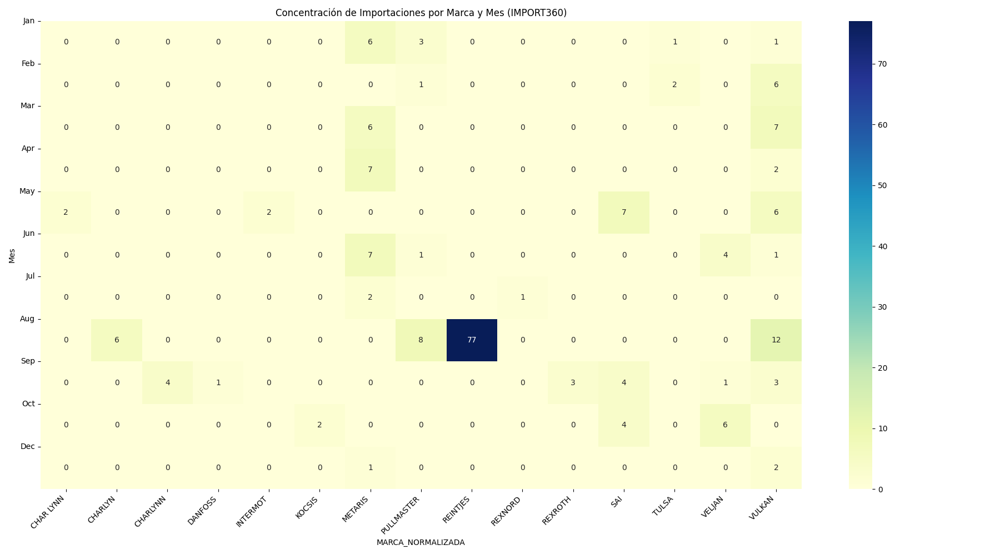
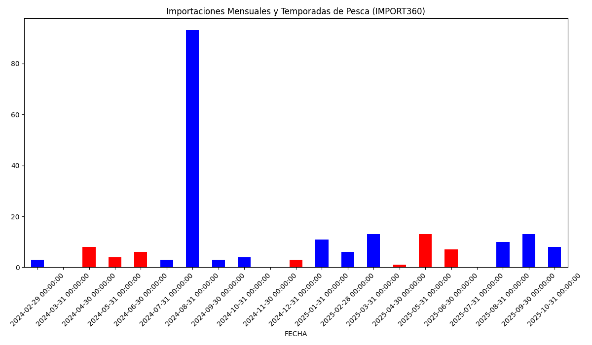

# Análisis Comparativo de Importaciones: Jorle vs. IMPORT360

## Resumen del Análisis

Este análisis explora los datos de importación de **Jorle** e **IMPORT360** para identificar patrones estacionales y tendencias relacionadas con las temporadas de pesca en Perú. A continuación, se presenta un análisis comparativo y un desglose individual para cada empresa.

### Estadísticas Descriptivas (Columnas Relevantes)

```
--- Resumen Estadístico (Columnas Relevantes) ---
            US$ FOB    US$ FLETE  US$ SEGURO       US$ CIF    PESO NETO   PESO BRUTO    CANTIDAD
count    329.000000   329.000000  329.000000    329.000000   329.000000   329.000000  329.000000
mean    3134.049240    69.192401   23.300304   3226.542097    71.421064    79.869696    7.362918
std     5357.975135   203.939527   57.050857   5501.949219   179.324114   208.179345   16.188483
min        0.880000     0.020000    0.020000      0.920000     0.010000     0.010000    0.010000
25%      272.340000     2.930000    1.210000    280.820000     1.450000     1.610000    1.000000
50%     1037.480000    11.940000    5.730000   1043.860000     7.300000     8.260000    2.000000
75%     3245.370000    43.150000   18.960000   3300.770000    39.000000    41.290000    8.000000
max    42891.470000  1806.250000  750.600000  43778.550000  1400.000000  1763.100000  192.000000
```

## Análisis Comparativo

### Comparativo Mensual de Importaciones entre Empresas


## Análisis Individual: Jorle

### Tendencia Mensual de Importaciones por Marca (Jorle)


### Top 15 Productos (MODELO) Más Importados (Jorle)


### Concentración de Importaciones por Marca y Mes (Jorle)


### Importaciones Mensuales y Temporadas de Pesca (Jorle)


## Análisis Individual: IMPORT360

### Tendencia Mensual de Importaciones por Marca (IMPORT360)


### Top 15 Productos (MODELO) Más Importados (IMPORT360)


### Concentración de Importaciones por Marca y Mes (IMPORT360)


### Importaciones Mensuales y Temporadas de Pesca (IMPORT360)


## Conclusiones y Productos Relevantes

### Coincidencias y Patrones
- **Patrón Estacional:** Ambas empresas muestran un aumento en las importaciones durante los meses de temporada de pesca (abril-junio y noviembre-diciembre), lo que sugiere una estrategia de aprovisionamiento anticipado.
- **Marcas Dominantes:** Marcas como **SAI** y **VELJAN** son relevantes para ambas empresas, aunque cada una tiene sus propias marcas preferidas.

### Top 15 Productos (MODELO) en Temporada de Pesca
A continuación se listan los productos más importados durante las temporadas de pesca:
```
--- Top 15 Productos (MODELO) en Temporada de Pesca ---
MODELO
0054100031     2
0053060089     2
S14-28180      2
S24-10219-0    2
FC51-1-1/4     2
0154427212     2
'K140000250    2
923157         2
0133106394     1
0054020017     1
0140000012     1
0190000083     1
0140130087     1
M-12-3-97-7    1
0006167-000    1
```
