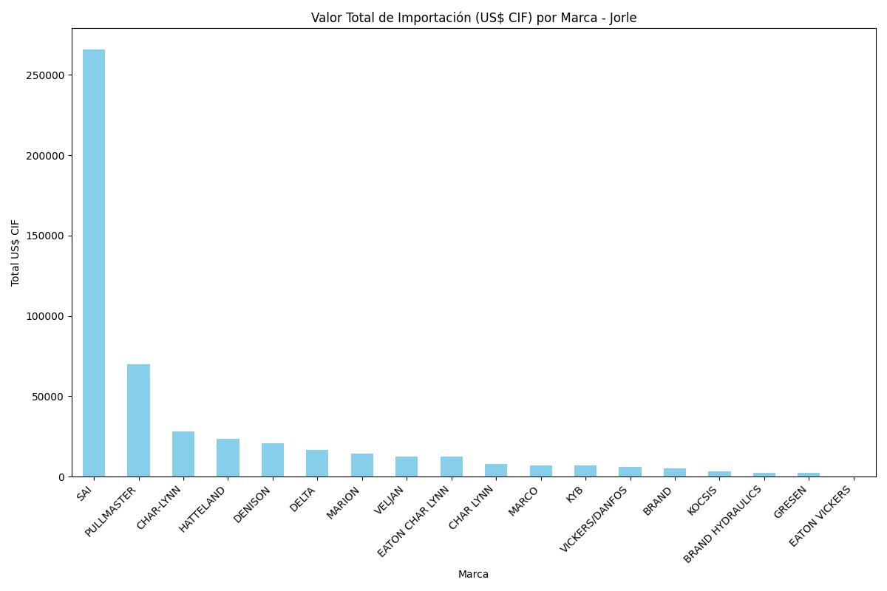
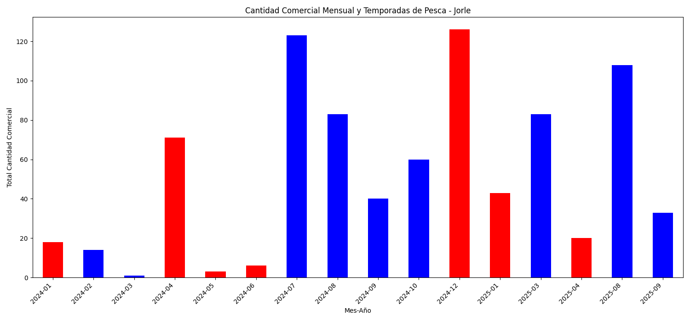
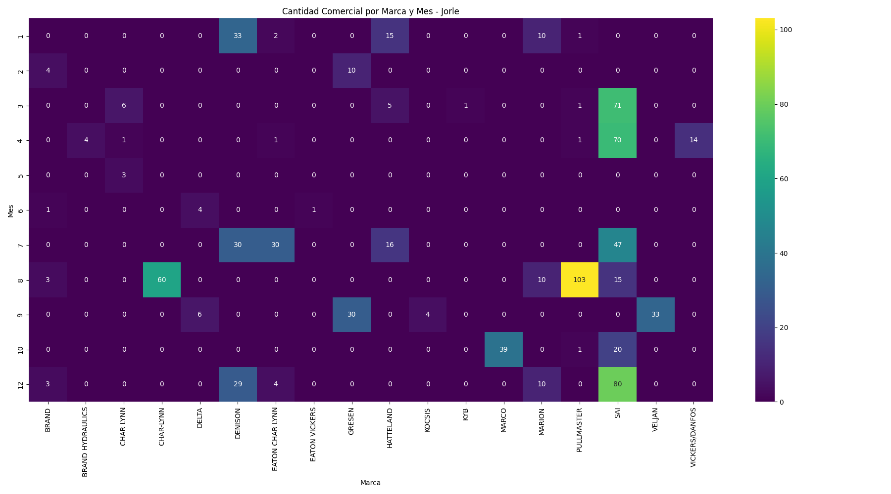
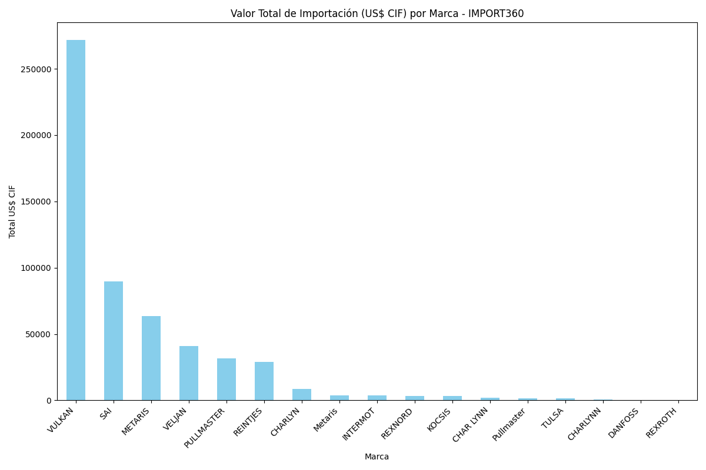
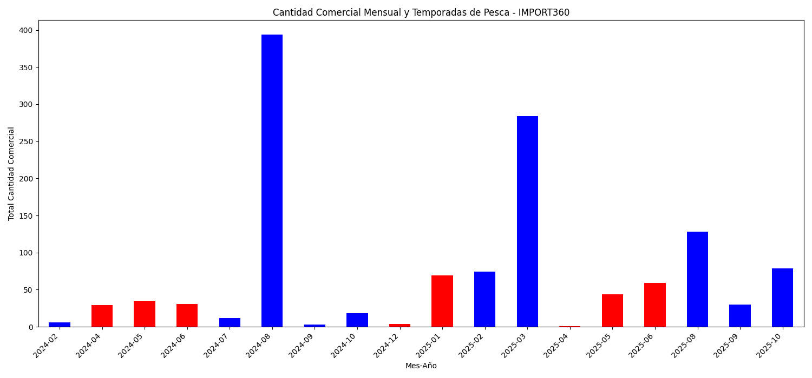
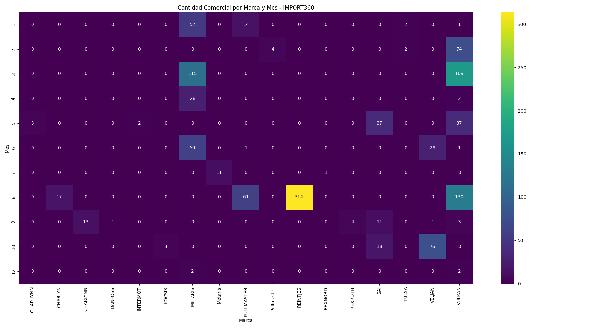

# Análisis de Importaciones para el Sector Pesquero: 

## 1. Resumen del Proyecto

Análisis Exploratorio de Datos (EDA) sobre las importaciones de dos empresas clave, **Jorle** e **IMPORT360**, para identificar patrones estacionales y tendencias de compra vinculadas a las **temporadas de pesca en Perú** (Abril-Junio y Noviembre-Enero).

El análisis se centra en el **valor de importación (US$ CIF)** y la **cantidad comercial** para ofrecer una visión estratégica del comportamiento de compra de cada empresa.

**Estructura del Repositorio:**
- **/data**: Contiene los archivos Excel originales.
- **/src**: Contiene el script de análisis `analisis.py`.
- **/output**: Contiene todos los resultados generados (gráficos y tablas CSV).

## 2. Análisis Individual: Jorle

### 2.1. Valor de Importación (US$ CIF) por Marca

*   **Análisis:** La marca **SAI** domina claramente en términos de valor de importación para Jorle, seguida a distancia por **PULLMASTER** y **CHAR-LYNN**. Esto sugiere una fuerte dependencia o especialización en los productos de estas marcas.

### 2.2. Cantidad Comercial y Temporadas de Pesca

*   **Análisis:** Se observa un comportamiento cíclico claro. Los picos en la cantidad comercial de importaciones coinciden directamente con los meses de **temporada de pesca** (marcados en rojo), especialmente en los períodos de Abril-Junio. Esto confirma la hipótesis de que Jorle realiza sus compras en preparación para el aumento de la demanda del sector pesquero.

### 2.3. Mapa de Calor de Cantidad Comercial por Marca y Mes

*   **Análisis:** El mapa de calor refuerza el patrón estacional. Marcas como **SAI** y **VELJAN** muestran una concentración de importaciones en los meses previos o durante las temporadas de pesca.

### 2.4. Tablas de Análisis para Jorle

#### Productos con Mayor Estacionalidad (Temporada de Pesca)
| MODELO | CANTIDAD COMERCIAL | US$ CIF |
| :--- | :--- | :--- |
| 'K190000250 | 20.0 | 2818.81 |
| 0154427212 | 20.0 | 6605.11 |
| S24-10219-0 | 20.0 | 1721.97 |
| 'K140000250 | 18.0 | 842.97 |
| 0054100031 | 15.0 | 32755.57 |

#### Productos Importados en los Últimos 3 Meses
| FECHA | MARCA | MODELO | MERCANCÍA | US$ CIF | CANTIDAD COMERCIAL | UNIDAD COMERCIAL |
| :--- | :--- | :--- | :--- | :--- | :--- | :--- |
| 2025-09-15 | VELJAN | VM4C-043-002 | "MOTOR HIDRAULICO, VELJAN, VM4C-043-002" | 2519.41 | 3.0 | UNIDAD |
| 2025-09-15 | VELJAN | V034-67030 | "ANILLO, VELJAN, V034-67030" | 1477.66 | 5.0 | UNIDAD |
| 2025-09-15 | VELJAN | VS24-10228 | "CARTUCHO, VELJAN, VS24-10228" | 5516.59 | 10.0 | UNIDAD |
| 2025-08-27 | CHAR-LYNN | 119-1043-003 | "MOTOR HYDRAULICO, CHAR-LYNN, 119-1043-003" | 9686.33 | 5.0 | UNIDAD |
| 2025-08-20 | SAI | 0053100081 | "MOTOR HIDRAULICO, SAI, 0053100081" | 1939.88 | 1.0 | UNIDAD |

## 3. Análisis Individual: IMPORT360

### 3.1. Valor de Importación (US$ CIF) por Marca

*   **Análisis:** A diferencia de Jorle, IMPORT360 tiene una distribución de valor más diversificada entre sus marcas principales, con **VELJAN**, **VULKAN**, y **SAI** liderando. Esto podría indicar una estrategia de menor dependencia de un único proveedor.

### 3.2. Cantidad Comercial y Temporadas de Pesca

*   **Análisis:** IMPORT360 también muestra un patrón estacional, aunque sus picos de importación parecen ocurrir ligeramente **antes** del inicio de la temporada de pesca. Esto sugiere una estrategia de aprovisionamiento más anticipada en comparación con Jorle.

### 3.3. Mapa de Calor de Cantidad Comercial por Marca y Mes

*   **Análisis:** El mapa de calor muestra que marcas como **VELJAN** y **VULKAN** son importadas consistentemente durante los meses previos a la temporada alta.

### 3.4. Tablas de Análisis para IMPORT360

#### Productos con Mayor Estacionalidad (Temporada de Pesca)
| MODELO | CANTIDAD COMERCIAL | US$ CIF |
| :--- | :--- | :--- |
| 7033614000 | 32.0 | 404.16 |
| S24-40383-0 | 26.0 | 27708.50 |
| S24-10219-0 | 24.0 | 1302.56 |
| 923157 | 20.0 | 579.80 |
| VS14-29879 | 16.0 | 1245.54 |

#### Productos Importados en los Últimos 3 Meses
| FECHA | MARCA | MODELO | MERCANCÍA | US$ CIF | CANTIDAD COMERCIAL | UNIDAD COMERCIAL |
| :--- | :--- | :--- | :--- | :--- | :--- | :--- |
| 2025-10-23 | VELJAN | VS24-40383 | "CARTUCHO, VELJAN, VS24-40383" | 9811.20 | 12.0 | UNIDAD |
| 2025-10-23 | VELJAN | VS14-29879-0 | "KIT DE SELLOS, VELJAN, VS14-29879-0" | 2343.03 | 30.0 | UNIDAD |
| 2025-10-10 | KOCSIS | DV-206676 | "PINON DE ARRCADOR. KOCSIS. DV-206676" | 1322.40 | 2.0 | UNIDAD |
| 2025-09-12 | VELJAN | VR5V085 | "VALVULA DE ALIVIO, VELJAN, VR5V085" | 443.20 | 1.0 | UNIDAD |
| 2025-09-08 | SAI | GM4 1000 | "MOTORES OLEOHIDRAULICOS, SAI, GM4 1000" | 13351.26 | 4.0 | UNIDAD |

## 4. Comparación y Sugerencias

*   **Estrategia de Compras:** **Jorle** parece seguir un modelo *Just-in-Time*, con compras que coinciden con el inicio de la temporada de pesca. **IMPORT360** adopta un enfoque de mayor anticipación, lo que podría darle una ventaja en disponibilidad y precios.
*   **Dependencia de Marcas:** Jorle tiene una alta dependencia de la marca **SAI**, lo que podría ser un riesgo. IMPORT360 tiene una cartera de marcas más diversificada.
*   **Sugerencia:** Ambas empresas podrían beneficiarse de analizar los productos estacionales de su competidor. Por ejemplo, Jorle podría explorar la viabilidad de incorporar modelos de **VELJAN** que son clave para IMPORT360, y viceversa. Este análisis cruzado podría revelar oportunidades para diversificar su oferta y capturar una mayor cuota de mercado.
