# Análisis de Valor de Importaciones (US$ CIF): Jorle vs. IMPORT360

## Resumen del Análisis

Este análisis explora el **valor de las importaciones (US$ CIF)** de **Jorle** e **IMPORT360**, con el objetivo de identificar patrones estacionales y tendencias de valor relacionadas con las temporadas de pesca en Perú.

### Estadísticas Descriptivas (Columnas Relevantes)

```
--- Resumen Estadístico (Columnas Relevantes) ---
            US$ CIF  CANTIDAD COMERCIAL    PESO NETO   PESO BRUTO
count    329.000000          329.000000   329.000000   329.000000
mean    3226.542097            6.479027    71.421064    79.869696
std     5501.949219            8.057693   179.324114   208.179345
min        0.920000            1.000000     0.010000     0.010000
25%      280.820000            1.000000     1.450000     1.610000
50%     1043.860000            3.000000     7.300000     8.260000
75%     3300.770000           10.000000    39.000000    41.290000
max    43778.550000           60.000000  1400.000000  1763.100000
```

## Análisis Comparativo por Valor (US$ CIF)

### Comparativo Mensual de Valor de Importaciones
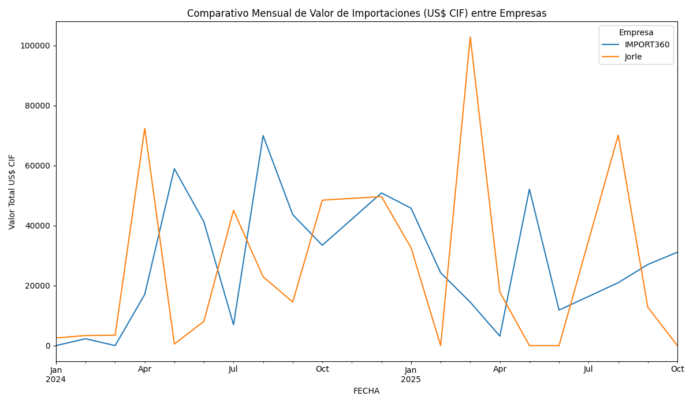

## Análisis Individual: Jorle

### Tendencia Mensual por Valor (Jorle)
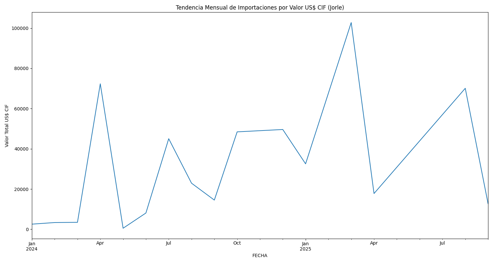

### Top 15 Productos por Frecuencia (Jorle)
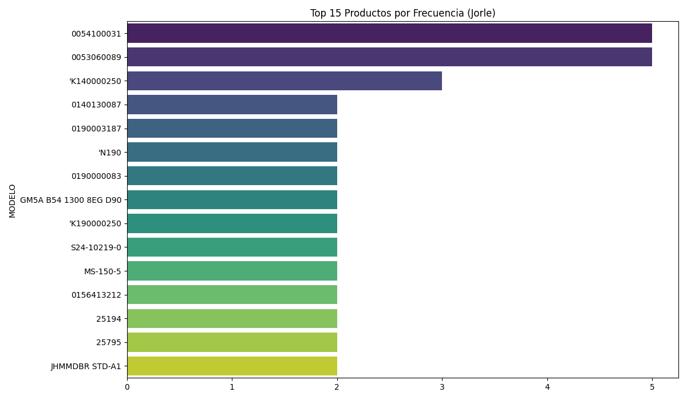

### Top 15 Productos por Valor US$ CIF (Jorle)
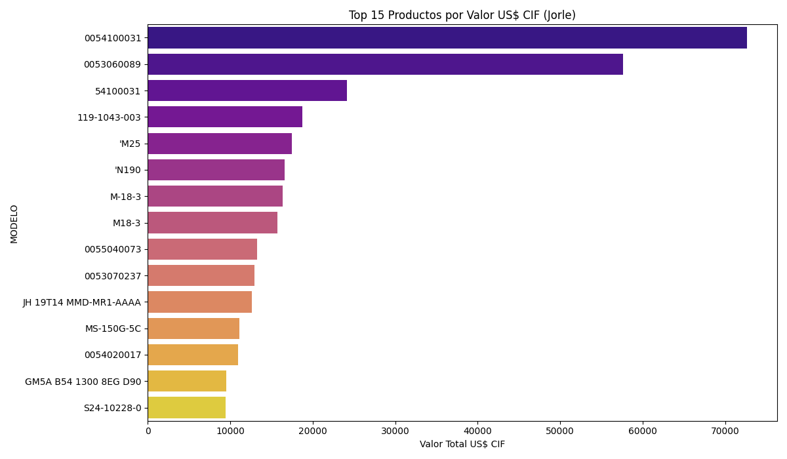

### Valor de Importaciones por Marca y Mes (Jorle)
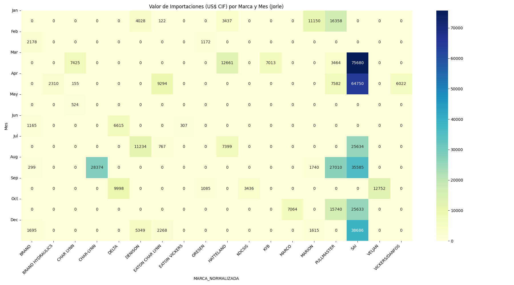

### Valor de Importaciones y Temporadas de Pesca (Jorle)
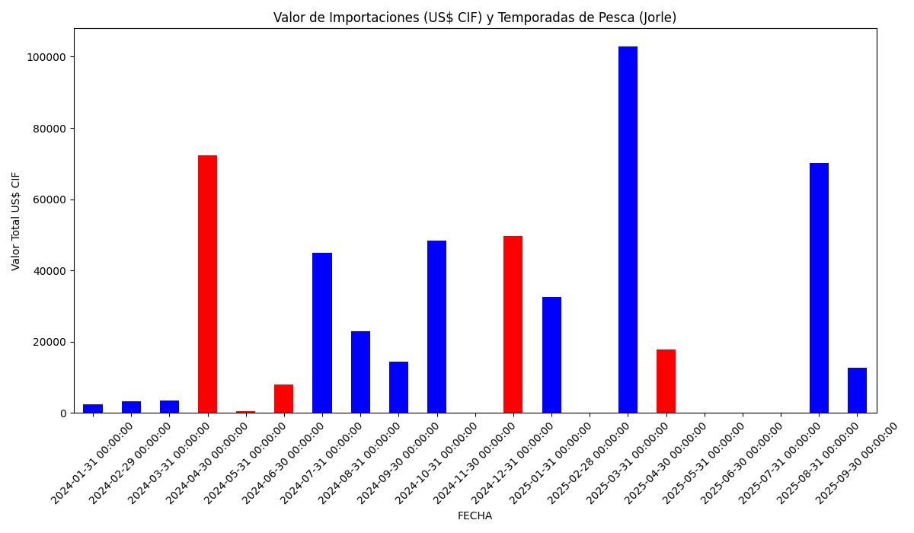

## Análisis Individual: IMPORT360

### Tendencia Mensual por Valor (IMPORT360)
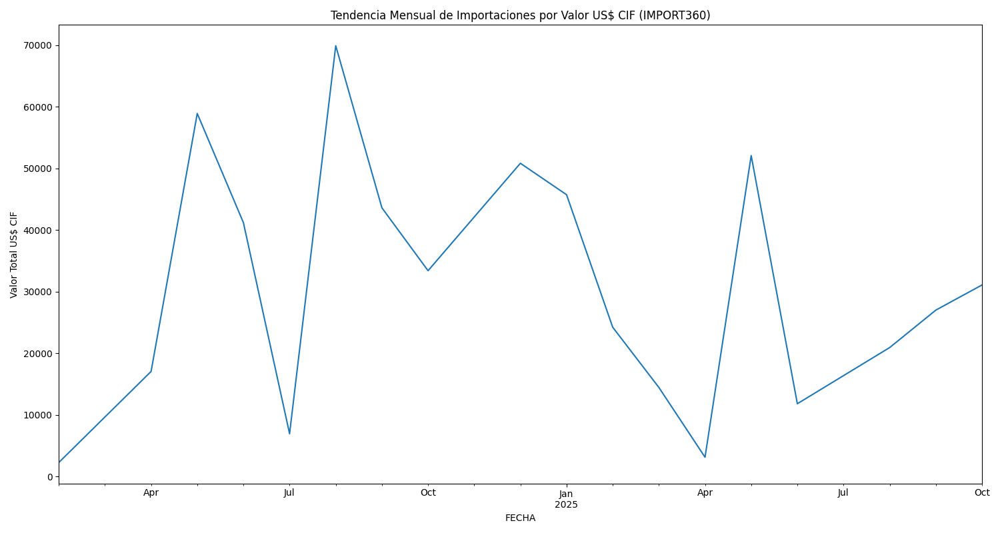

### Top 15 Productos por Frecuencia (IMPORT360)
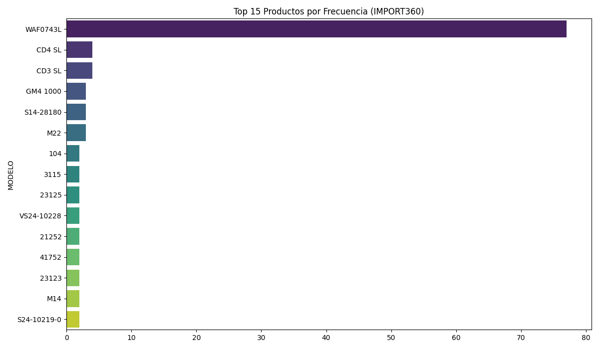

### Top 15 Productos por Valor US$ CIF (IMPORT360)
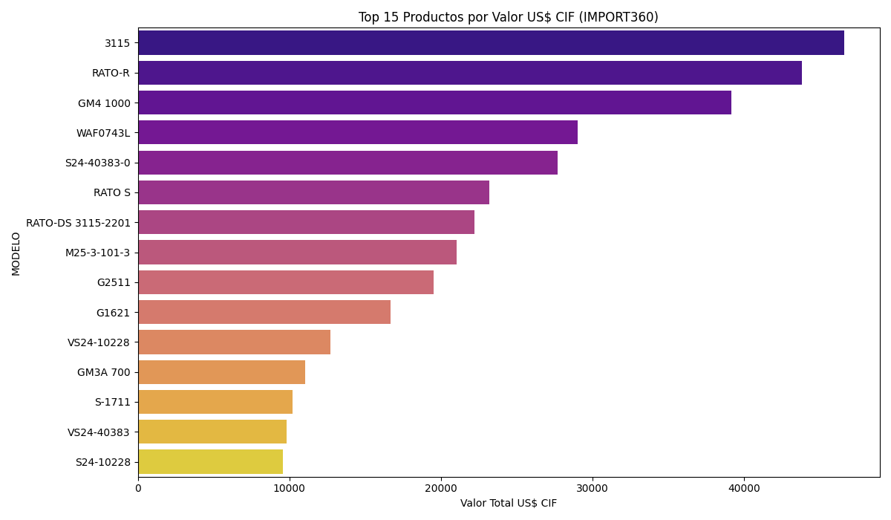

### Valor de Importaciones por Marca y Mes (IMPORT360)
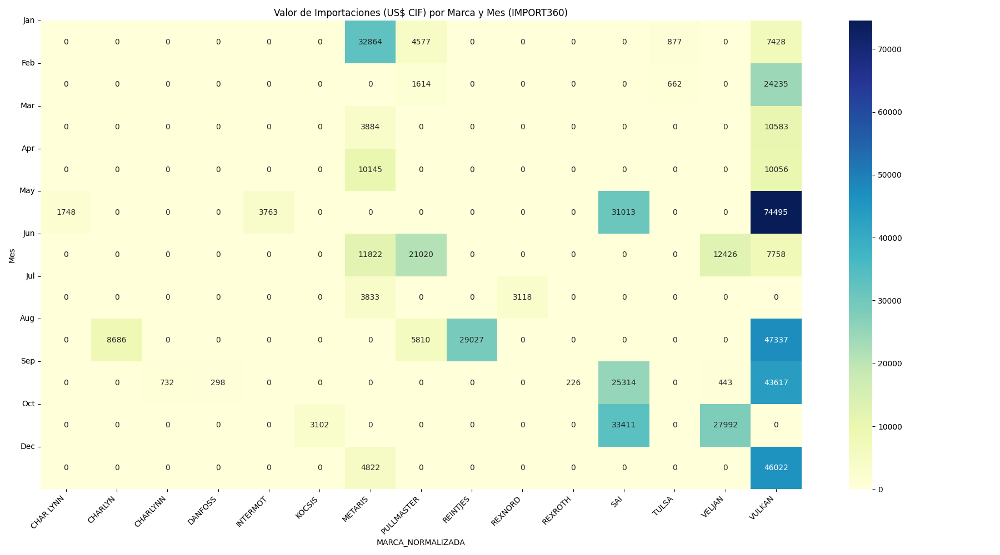

### Valor de Importaciones y Temporadas de Pesca (IMPORT360)
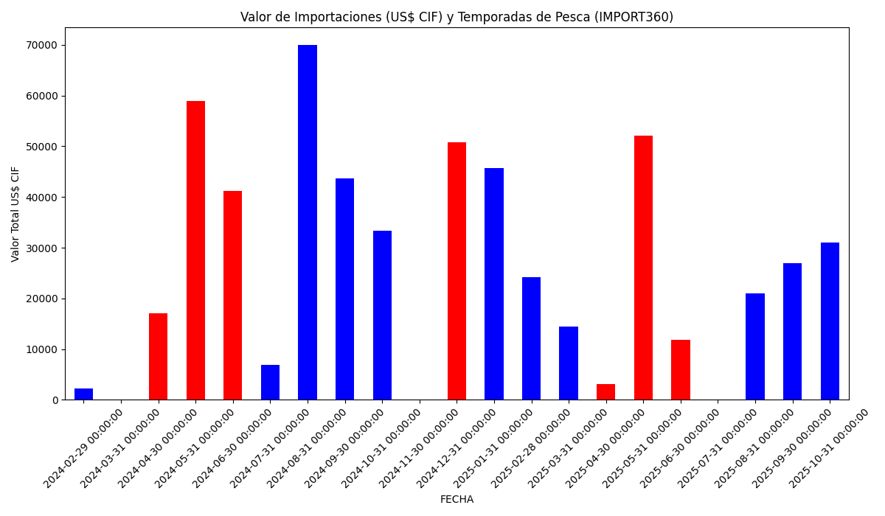

## Conclusiones y Productos de Mayor Valor

### Coincidencias y Patrones
- **Patrón Estacional de Valor:** Ambas empresas incrementan significativamente el valor de sus importaciones en los meses de temporada de pesca.
- **Productos de Alto Valor:** El análisis por valor revela que ciertos productos, aunque no se importan con alta frecuencia, representan una inversión económica considerable.

### Top 15 Productos por Valor en Temporada de Pesca
A continuación, los productos de mayor valor `US$ CIF` importados durante las temporadas de pesca:
```
--- Top 15 Productos (MODELO) por Valor US$ CIF en Temporada de Pesca ---
MODELO
RATO-R               43778.55
0054100031           32755.57
3115                 23831.42
RATO-DS 3115-2201    22190.11
M25-3-101-3          21020.38
0053060089           19870.22
0053070237           12948.12
RATO S               11056.98
0054020017           10980.11
S24-10228             9592.38
119-1043              9294.37
RATO-S                7757.90
GM5A                  7733.48
GS4                   7688.40
M-12-3-97-7           7581.66
```
